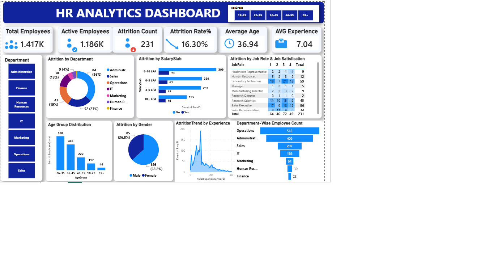

# HR Analytics Dashboard

## Project Overview
This project is an interactive HR Analytics Dashboard developed using Power BI to analyze employee attrition, workforce demographics, salary distribution, and job satisfaction. The dashboard helps HR teams identify key trends and supports data-driven decision-making.

## Tools Used
- Power BI
- Power Query
- DAX
- Microsoft Excel (CSV Dataset)

## Dashboard Features
- Total Employees
- Active Employees
- Attrition Count
- Attrition Rate
- Average Age
- Average Experience
- Department-wise Attrition Analysis
- Salary Slab Analysis
- Job Satisfaction Analysis
- Gender-wise Attrition
- Age Group Distribution
- Experience-wise Attrition Trend
- Department-wise Employee Count

## Dashboard Preview

## Dataset
- HR_Analytics-4.csv

## Project Files
- HR_Analytics_Dashboard.pbix
- HR_Analytics-4.csv
- Dashboard.png

## Skills Demonstrated
- Data Cleaning
- Data Modeling
- DAX Measures
- Interactive Dashboard Design
- Business Intelligence
- Data Visualization

## Author
Ajith P S
